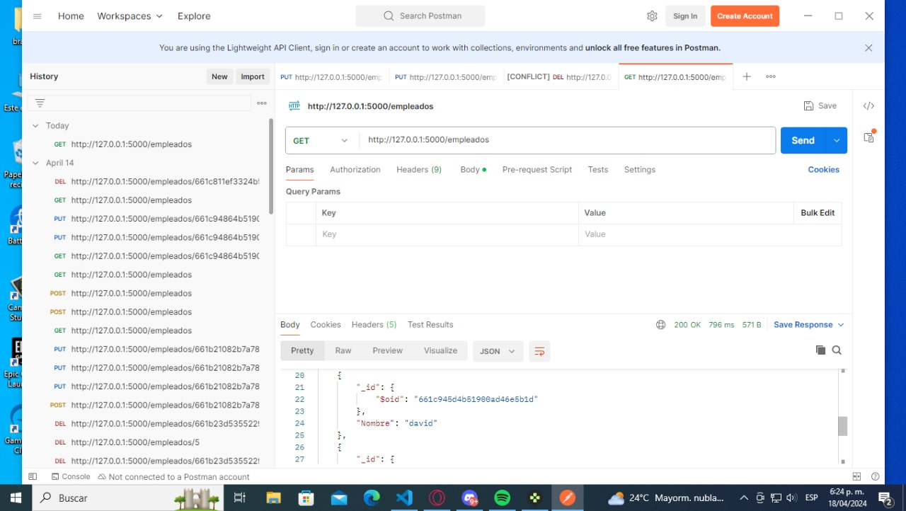
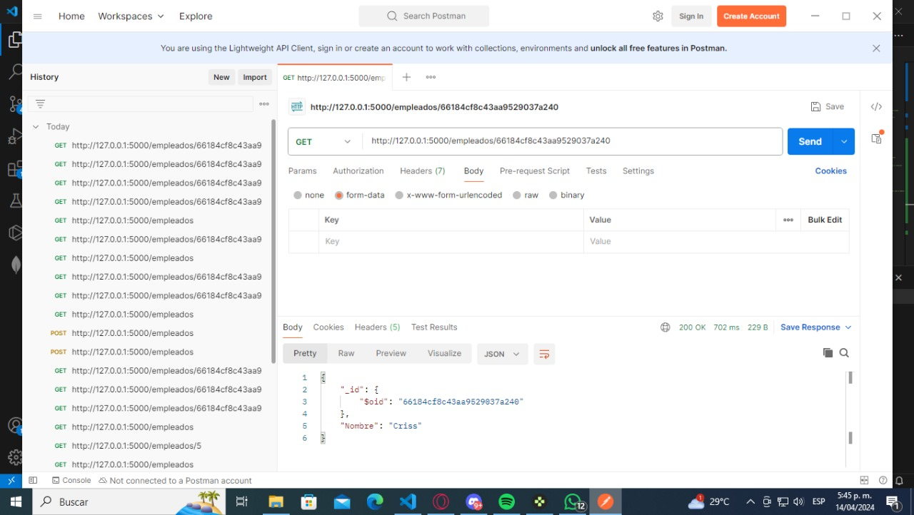
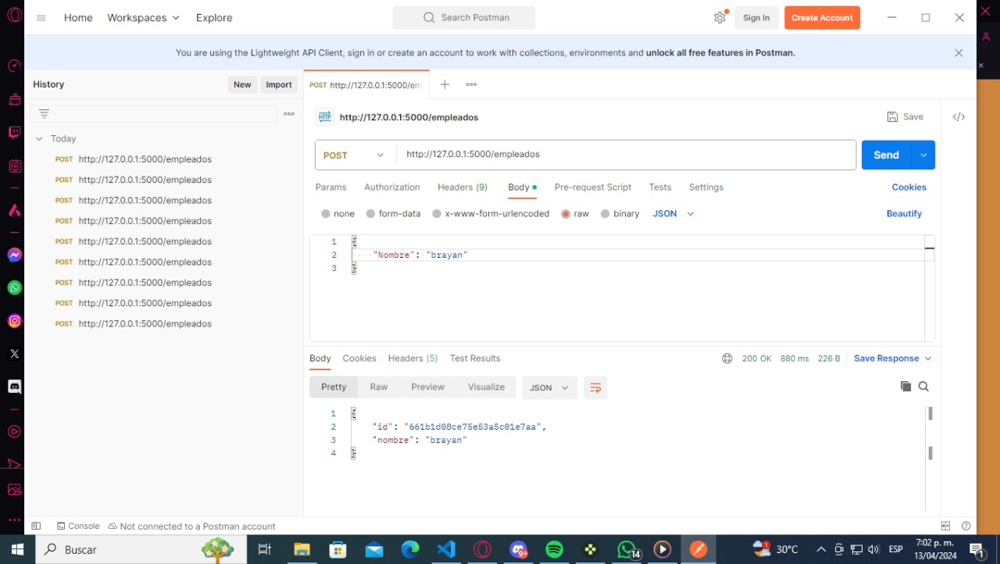
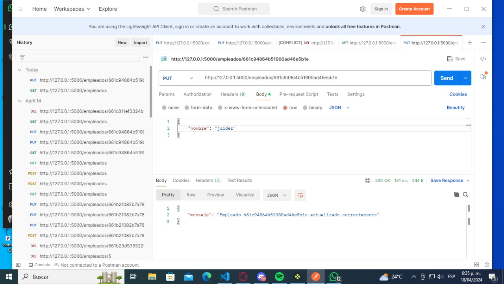
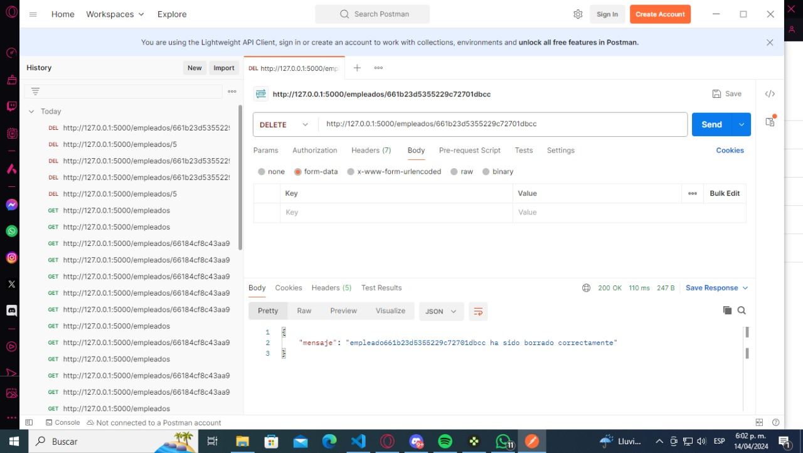

  # CRUD---PY-SLAG-Mongo-RESTFULAPI---replicacion
Implementacin de mongo, python, slag y restful API con replicacion
<h1>Rama de steven</h1>
  En esta rama se aportaran los avances de steven
  <h1> Herramientas para realizar las API</h1>
 <h2> Para el funcionamiento se necesitan las siguientes librerias: </h2>
  
    from flask import Flask, redirect, jsonify, request
    from pymongo import MongoClient
    from bson import json_util
    
De flask importamos flask para las funciones del framework, redirect para tener response, jsonify para devolver formatos json, request para traer informacion por ejemplo de la base de datos.  
De pymongo importamos MongoClient para interactuar con mongodb.  
De bson importamos json_util para utilidades con el formato json, por ejemplo volver en formato json la informacion que se trae de la base de datos.  
 
<h2>Ejemplo de API con el metodo GET para obtener los empleados</h2>
En la ruta /empleados usamos el metodo GET, definimos get_empleados(), empleados sera igual a una lista buscada en empleados_collection, response sera igual empleados traido en formato json con ayuda de json_util.dumps y retornamos response.
Lo demas es en caso de error

           # API método GET para obtener todos los empleados
            @app.route('/empleados', methods=['GET'])
            def get_empleados():
                empleados = list(empleados_collection.find())  # Obtener todos los empleados de la colección
                response = json_util.dumps(empleados)  # Convertir la lista de empleados a formato JSON
                return Response(response, mimetype='application/json')  # Devolver la respuesta JSON
<h2>Ejemplo API con el metodo GET para buscar a un empleado</h2>
Se crea la ruta /empleados/<id> utilizando el metodo GET, se define get_empleado(id), se busca en la coleccion de empleados uno por medio del id, si se encuentra se convierte la informacion a json y se devuelve la respuesta, en caso de que no se encuentre se retorna la respuesta negativa.

    # API método GET para obtener un empleado específico por su ID
    @app.route('/empleados/<id>', methods=['GET'])
    def get_empleado(id):
        empleado = empleados_collection.find_one({'_id': ObjectId(id)})  # Obtener un empleado de la colección
        if empleado:
            response = json_util.dumps(empleado)  # Convertir el empleado a formato JSON
            return Response(response, mimetype='application/json')  # Devolver la respuesta JSON
        else:
            return not_found() # Devolver la respuesta
<h2>Ejemplo API con el metodo POST para crear empleados</h2>
En la ruta /empleados se usa el metodo POST, se define post_empleados, con request se reciben los datos en json, se verifica si Nombre esta entre los datos, se prepara para insertar el empleado en la coleccion con un json y el id generado,  al  final retorna la respuesta; en caso de que no se proporcione un nombre deberia generar error.

    # API método POST para crear un empleado
    @app.route('/empleados', methods=['POST'])
    def post_empleados():
        # Recibir los datos del JSON de la solicitud
        datos = request.get_json()

    # Verificar si el campo 'Nombre' está presente en los datos recibidos
    if 'Nombre' in datos:
        nombre = datos['Nombre']

        # Insertar el nuevo empleado en la colección de empleados
        id = empleados_collection.insert_one({'Nombre': nombre}).inserted_id

        # Crear la respuesta JSON con el ID generado y el nombre del empleado
        response = {
            'id': str(id),
            'nombre': nombre
        }

        # Devolver la respuesta JSON
        return jsonify(response)
    else:
        # Si no se proporciona el campo 'Nombre', devolver un mensaje de error
        return not_found()
<h2>Ejemplo de API con el metodo DELETE para eliminar un empleado</h2>
En la ruta /empleados/<id> se usa el metodo DELETE, se define delete_empleado(id), se elije un empleado de la coleccion para eliminar por medio del id, se guarda el mensaje de que se borro y se retorna este.

    # API método DELETE para eliminar un empleado por su ID
    @app.route('/empleados/<id>', methods=['DELETE'])
    def delete_empleado(id):
        empleados_collection.delete_one({'_id': ObjectId(id)})  # Elegir a un empleado para eliminar
        response = jsonify({'mensaje' : 'Empleado ' + id + ' ha sido borrado correctamente'})  # Mensaje que el empleado fue borrado correctamente
        return response
<h2>Ejemplo de API con el metodo PUT para actualizar un empleado</h2>
En la ruta /empleados/<id> se usa el metodo PUT, se define update_empleado(id), se verifica el si el id es valido, se verifica si el nombre esta en el json, se actualiza el empleado en la base de datos, en el caso de que los datos sean invalidos esto no procede.

        # API método PUT para actualizar un empleado por su ID
        @app.route('/empleados/<id>', methods=['PUT'])
        def update_empleado(id):
            try:
                # Verificar si el ID del empleado es válido
                if not ObjectId.is_valid(id):
                    return jsonify({'error': 'ID de empleado no válido'}), 400

        # Verificar si se proporcionó el campo 'nombre' en el JSON
        if 'nombre' not in request.json:
            return jsonify({'error': 'Campo "nombre" requerido'}), 400

        nombre_nuevo = request.json['nombre']

        # Actualizar el empleado en la base de datos
        resultado = empleados_collection.update_one(
            {'_id': ObjectId(id)},
            {'$set': {'Nombre': nombre_nuevo}}
        )

        if resultado.modified_count > 0:
            return jsonify({'mensaje': f'Empleado {id} actualizado correctamente'})
        else:
            return jsonify({'error': 'Empleado no encontrado'}), 404

    except Exception as e:
        return jsonify({'error': str(e)}), 500
<h2>Manejo del eror 404 para las APIs</h2>
Se usa el controlador de error de cabesera errorhandler(404), se define not_found(error=None), en response se guarda el mensaje en json y se retorna este mensaje ademas del status.

    # Manejador de errores para el código de estado 404 (Not Found)
    @app.errorhandler(404)
    def not_found(error=None):
        response = jsonify({
            'mensaje': 'Recurso no encontrado: ' + request.url,
            'status': 404
        })
        response.status_code = 404
        return response
<h1>Pruebas en Postman</h1> 
<h2>Mostrar todos GET</h2>

<h2>Mostrar uno GET</h2>

<h2>Crear uno Post</h2>

<h2>Actualizar uno PUT</h2>

<h2>Eliminar uno DELETE</h2>

 
